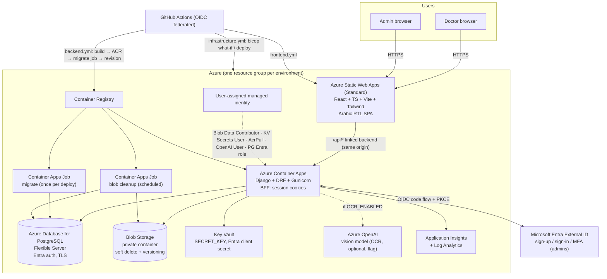
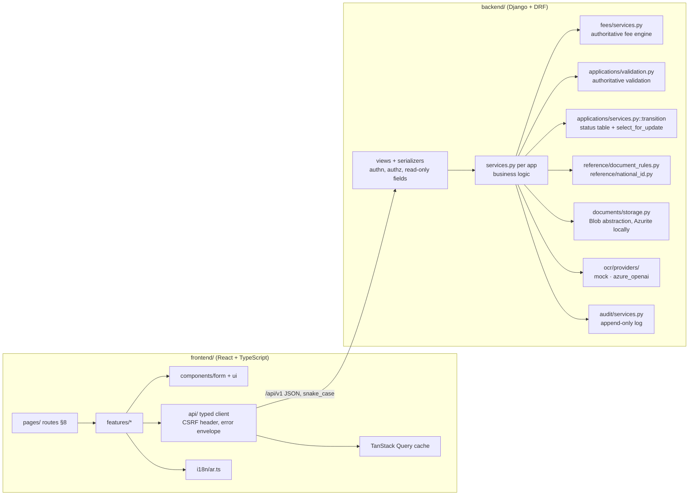
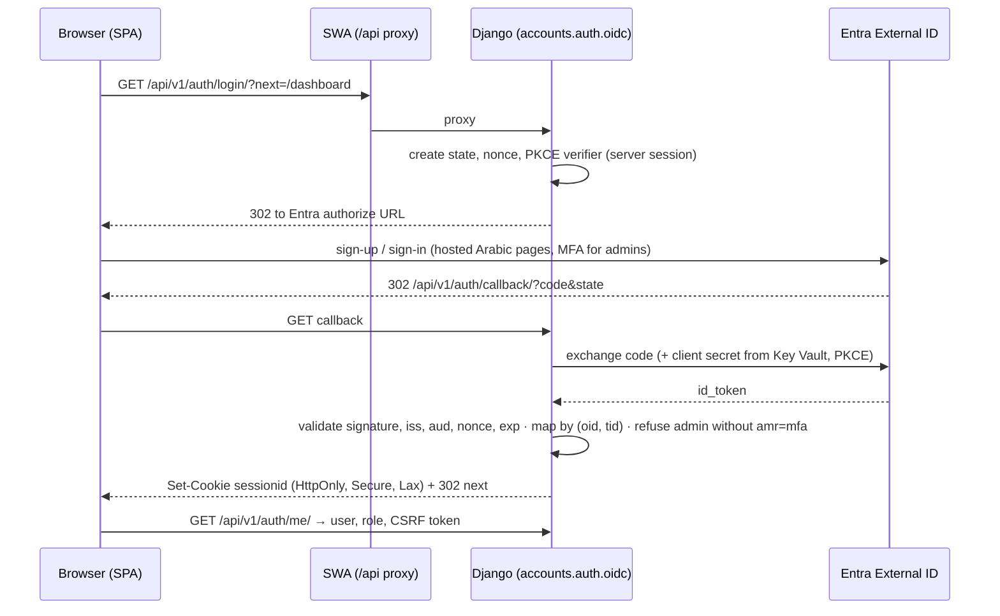
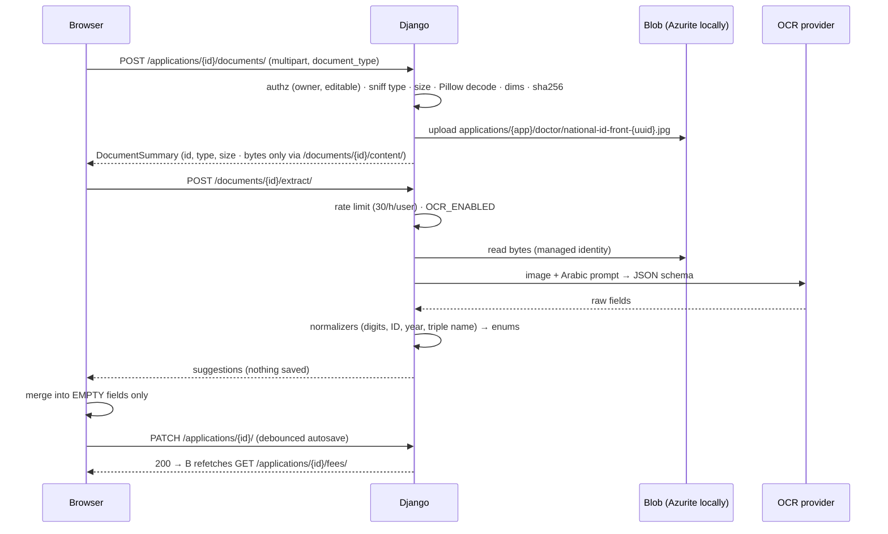
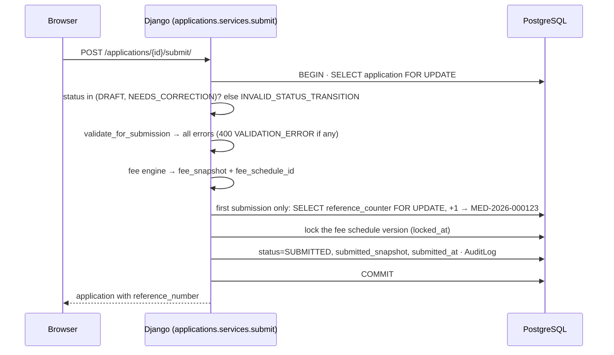
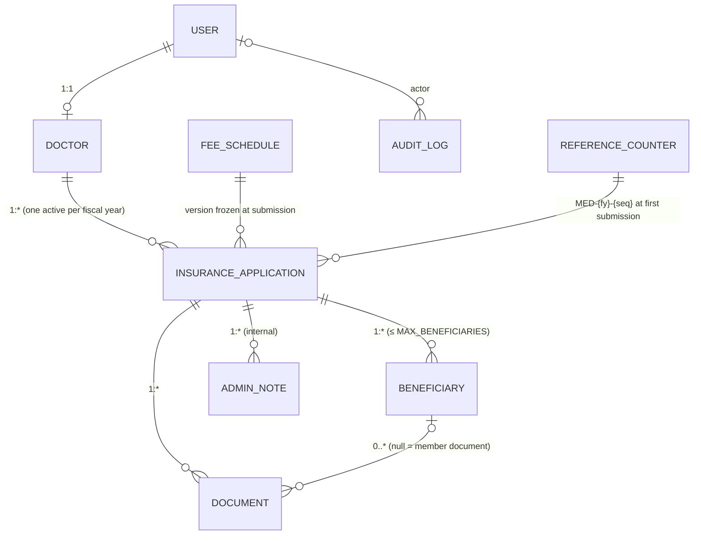
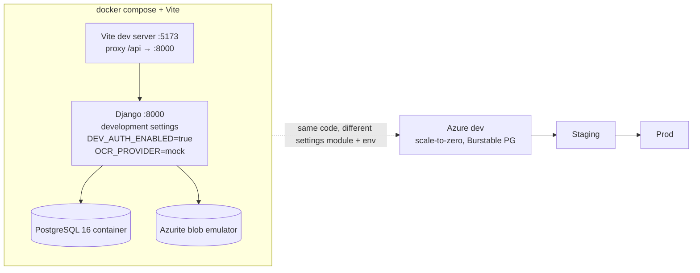
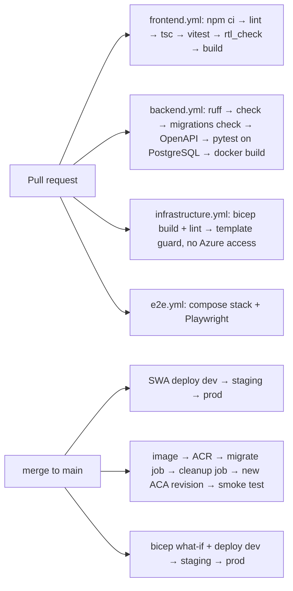

# Architecture

Production target: everything on Microsoft Azure. The browser talks to one origin (Azure Static Web
Apps); `/api/*` is proxied to Django on Azure Container Apps through the SWA **linked backend**, so
the HttpOnly session cookie is first-party. Django is the only component that touches PostgreSQL,
Blob Storage, Key Vault and Azure OpenAI, always through a user-assigned managed identity.

## 1. Azure target architecture



**Same-origin decision (PROMPT.md §4.1, option 1):** SWA Standard with the Container App as linked
backend. The SPA calls relative `/api/v1/...`; cookies are `HttpOnly; Secure; SameSite=Lax`. Fallback
(option 2, custom domains on one registrable domain) is documented in `docs/azure-deployment.md`
but not the default. Locally the Vite dev-server proxies `/api` to Django, same effect.

**Hard rules honoured:** PostgreSQL is a managed service, never a container; documents live in Blob,
never in the container filesystem or PostgreSQL; OCR is never called from the browser.

## 2. Application layers



The frontend owns presentation only. Fees, validation, status transitions, document rules and
reference data are computed on the server and fetched; the SPA never duplicates them.

## 3. Key request flows

### 3.1 Sign-in (BFF, Entra External ID)



Browser never holds tokens. `DEV_AUTH_ENABLED` replaces Entra only in development/test settings.

### 3.2 Upload → OCR suggestion → autosave



### 3.3 Submission



## 4. Data model (summary; columns, constraints and indexes in `docs/database.md`)



All primary keys are UUIDs; every foreign key is `ON DELETE PROTECT`. Constraints that carry
business rules: `Doctor.national_id` unique; partial unique `(doctor, fiscal_year) WHERE status <>
'REJECTED'`; partial unique `(application, national_id)` on beneficiaries; unique
`(application, row_number)`; one live document per `(application, beneficiary, document_type)`
(`NULLS NOT DISTINCT`); reference number present exactly when the status is not `DRAFT`;
one active fee schedule per fiscal year; audit log append-only (database trigger).

## 5. Environments and local development



Three Azure environments (`development`, `staging`, `production`) with separate resource groups,
identities, Key Vaults and Entra app registrations (or redirect URIs). Settings modules:
`config/settings/{base,development,test,production}.py`; configuration only via environment
variables / Key Vault references.

## 6. Security architecture (summary; details in `docs/security.md`)

- Authn: Entra External ID, BFF, PKCE, token validation, `(oid, tid)` mapping, MFA required for admins.
- Authz: Django-only; object-level checks on every endpoint; querysets scoped to the doctor;
  protected fields read-only on serializers; admin role granted via `manage.py grant_admin`.
- Data: private Blob container, ≤5-minute SAS or authorized stream, sha256, soft delete; national
  ID masked everywhere it is displayed or logged; logging filter masks 14-digit runs.
- Transport/config: HTTPS, HSTS, secure cookies, CSRF, security headers, CORS off in production,
  startup check refuses `DEV_AUTH_ENABLED` or missing settings in production.
- Secrets: Key Vault via managed identity; `.env.example` holds names only.
- MVP network posture (`enablePrivateNetworking=false`, the default): public HTTPS ingress on
  SWA and the Container App (the linked backend needs it); PostgreSQL accepts only Azure-internal
  connections (firewall rule "Azure services") with Entra tokens over TLS and password
  authentication off; Blob Storage and Key Vault keep public endpoints but refuse anonymous and
  shared-key access (Entra RBAC only); Azure OpenAI has key authentication disabled. Upgrade
  path, one parameter: `enablePrivateNetworking=true` adds a VNet-integrated Container Apps
  environment, a VNet-integrated PostgreSQL server without public access and private endpoints +
  private DNS for Blob, Key Vault and Azure OpenAI (`docs/azure-deployment.md`, *Production
  upgrade path*).

## 7. Scaling (PROMPT.md §35)

Django scales on Container Apps independently of the static frontend: HTTP-concurrency rule
(`httpConcurrency` concurrent requests per replica), `minReplicas`/`maxReplicas` per environment
(dev 0–2, staging 1–3, prod 1–5), `containerCpu`/`containerMemory` and `gunicornWorkers` all in
`infrastructure/parameters/<env>.bicepparam`. Replicas are stateless: sessions and rate-limit
counters live in PostgreSQL, files in Blob Storage, secrets in Key Vault, so any replica can be
destroyed at any time. The migrate and cleanup jobs run in the same environment with the same
image and identity.

```text
              Container Apps ingress (HTTPS, load balancing)
                    │
         ┌──────────┼──────────┐
         ▼          ▼          ▼
      Django     Django     Django      (Gunicorn, non-root, no local state)
      replica    replica    replica
         └──────────┼──────────┘
                    ▼
     PostgreSQL + Blob + Key Vault + Azure OpenAI (managed identity)
```

## 8. Deployment pipeline



GitHub OIDC federated credentials, no stored Azure passwords or deployment tokens. One GitHub
environment per Azure environment: `<env>` (deploy and manual what-if, `main` only, required
reviewers on `prod`). Pull requests get no Azure credential: ARM what-if needs write permission on
every resource, so a read-only preview identity is impossible (D145). Details: `docs/github-setup.md`.
