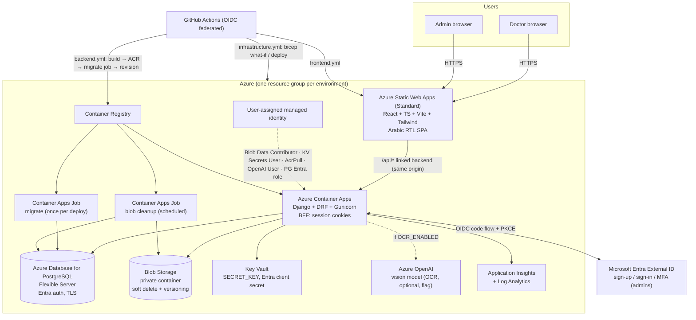
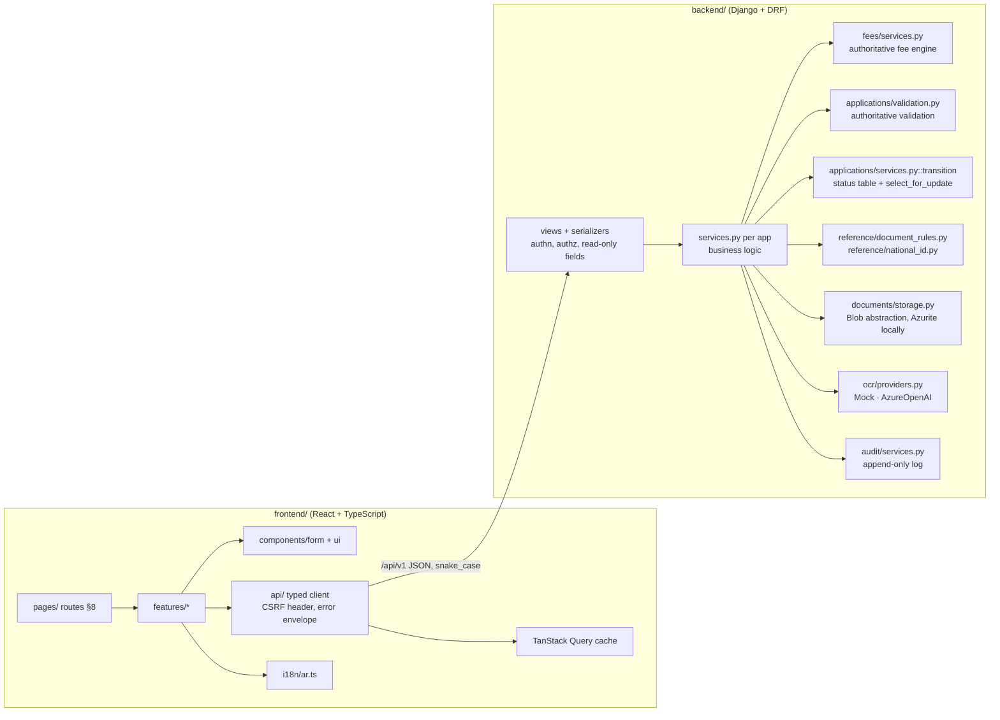
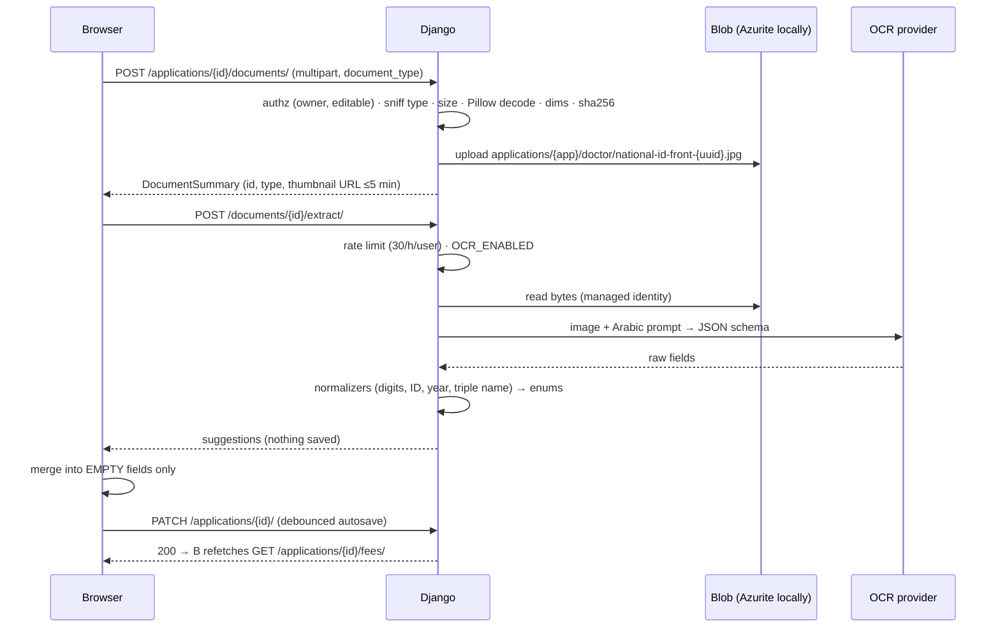
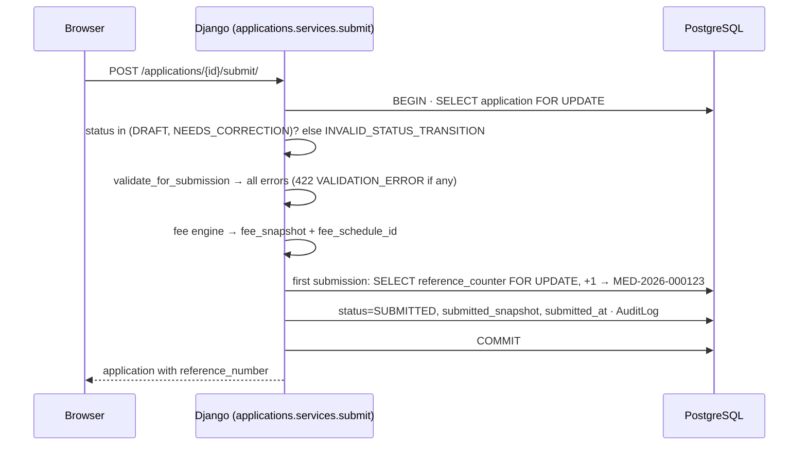
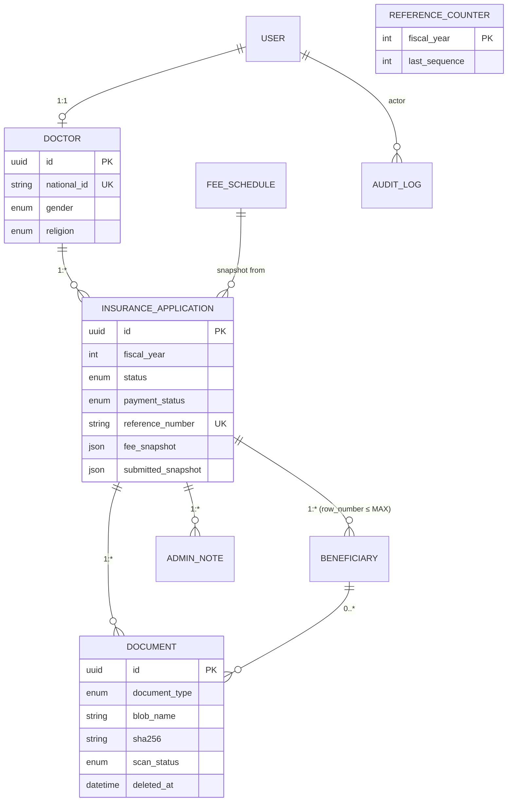
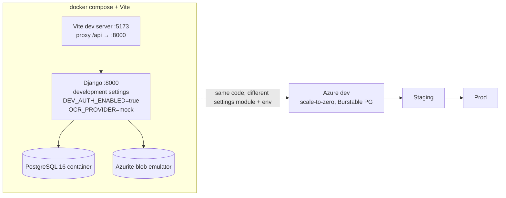
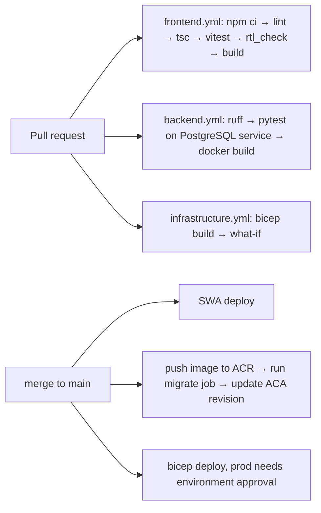

# Architecture

Production target: everything on Microsoft Azure. The browser talks to one origin (Azure Static Web
Apps); `/api/*` is proxied to Django on Azure Container Apps through the SWA **linked backend**, so
the HttpOnly session cookie is first-party. Django is the only component that touches PostgreSQL,
Blob Storage, Key Vault and Azure OpenAI, always through a user-assigned managed identity.

## 1. Azure target architecture



**Same-origin decision (PROMPT.md §4.1, option 1):** SWA Standard with the Container App as linked
backend. The SPA calls relative `/api/v1/...`; cookies are `HttpOnly; Secure; SameSite=Lax`. Fallback
(option 2, custom domains on one registrable domain) is documented in `docs/azure-deployment.md`
but not the default. Locally the Vite dev-server proxies `/api` to Django, same effect.

**Hard rules honoured:** PostgreSQL is a managed service, never a container; documents live in Blob,
never in the container filesystem or PostgreSQL; OCR is never called from the browser.

## 2. Application layers



The frontend owns presentation only. Fees, validation, status transitions, document rules and
reference data are computed on the server and fetched; the SPA never duplicates them.

## 3. Key request flows

### 3.1 Sign-in (BFF, Entra External ID)

```mermaid
sequenceDiagram
    participant B as Browser (SPA)
    participant S as SWA (/api proxy)
    participant DJ as Django (accounts.auth.oidc)
    participant E as Entra External ID
    B->>S: GET /api/v1/auth/login/?next=/dashboard
    S->>DJ: proxy
    DJ->>DJ: create state, nonce, PKCE verifier (server session)
    DJ-->>B: 302 to Entra authorize URL
    B->>E: sign-up / sign-in (hosted Arabic pages, MFA for admins)
    E-->>B: 302 /api/v1/auth/callback/?code&state
    B->>DJ: GET callback
    DJ->>E: exchange code (+ client secret from Key Vault, PKCE)
    E-->>DJ: id_token
    DJ->>DJ: validate signature, iss, aud, nonce, exp; map by (oid, tid); refuse admin without amr=mfa
    DJ-->>B: Set-Cookie sessionid (HttpOnly, Secure, Lax) + 302 next
    B->>DJ: GET /api/v1/auth/me/ → user, role, CSRF token
```

Browser never holds tokens. `DEV_AUTH_ENABLED` replaces Entra only in development/test settings.

### 3.2 Upload → OCR suggestion → autosave



### 3.3 Submission



## 4. Data model (summary; full ER diagram in `docs/database.md`)



Constraints that carry business rules: `Doctor.national_id` unique; partial unique
`(doctor, fiscal_year) WHERE status <> 'REJECTED'`; unique `(application, national_id)` on
beneficiaries; unique `(application, row_number)`; one active document per
`(application, beneficiary, document_type)`; `ON DELETE PROTECT` on everything audit-relevant.

## 5. Environments and local development



Three Azure environments (`development`, `staging`, `production`) with separate resource groups,
identities, Key Vaults and Entra app registrations (or redirect URIs). Settings modules:
`config/settings/{base,development,test,production}.py`; configuration only via environment
variables / Key Vault references.

## 6. Security architecture (summary; details in `docs/security.md`)

- Authn: Entra External ID, BFF, PKCE, token validation, `(oid, tid)` mapping, MFA required for admins.
- Authz: Django-only; object-level checks on every endpoint; querysets scoped to the doctor;
  protected fields read-only on serializers; admin role granted via `manage.py grant_admin`.
- Data: private Blob container, ≤5-minute SAS or authorized stream, sha256, soft delete; national
  ID masked everywhere it is displayed or logged; logging filter masks 14-digit runs.
- Transport/config: HTTPS, HSTS, secure cookies, CSRF, security headers, CORS off in production,
  startup check refuses `DEV_AUTH_ENABLED` or missing settings in production.
- Secrets: Key Vault via managed identity; `.env.example` holds names only.
- MVP network posture: public ingress on SWA/ACA, PostgreSQL and Storage firewalls restricted to
  Azure services / ACA outbound, no public blob access. Upgrade path: VNet-integrated ACA
  environment + private endpoints (documented, parameterized in Bicep).

## 7. Deployment pipeline



GitHub OIDC federated credentials, no stored Azure passwords; GitHub environments `dev`, `staging`,
`prod` with required reviewers on `prod`.
